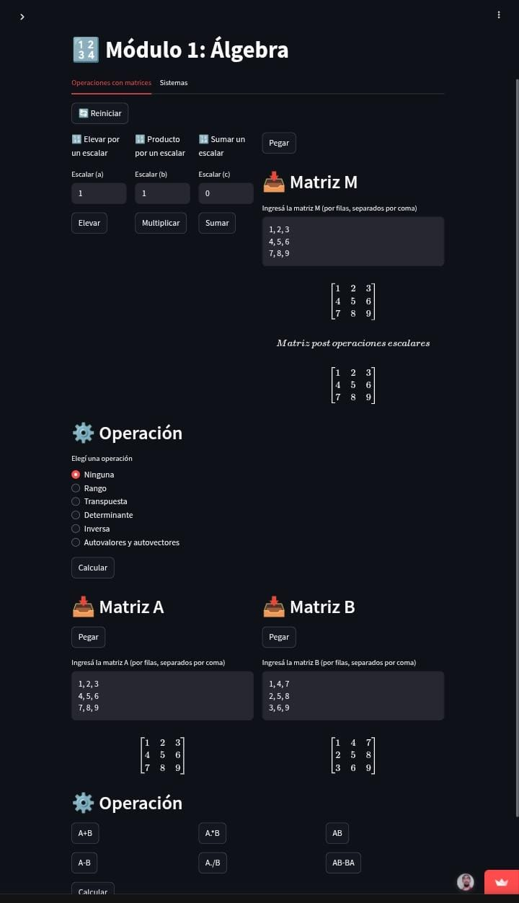
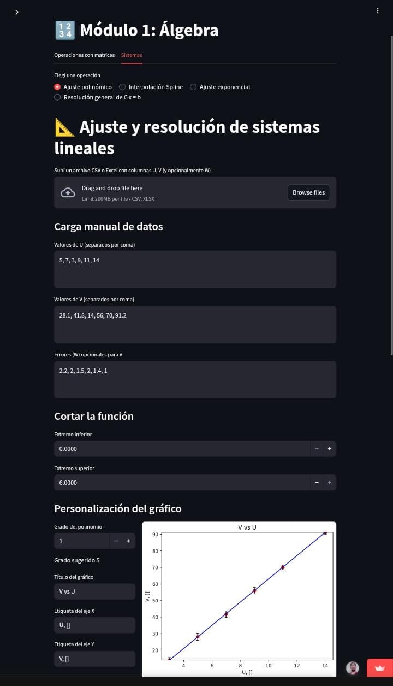
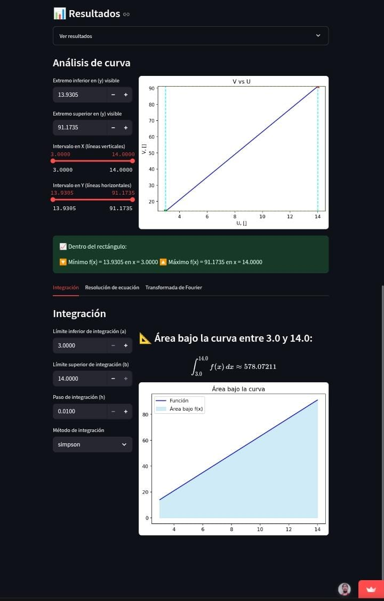
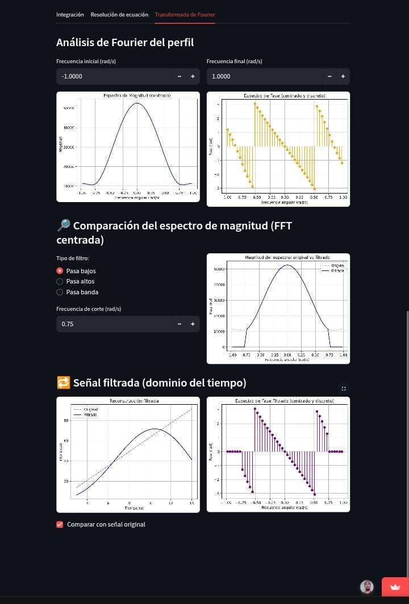
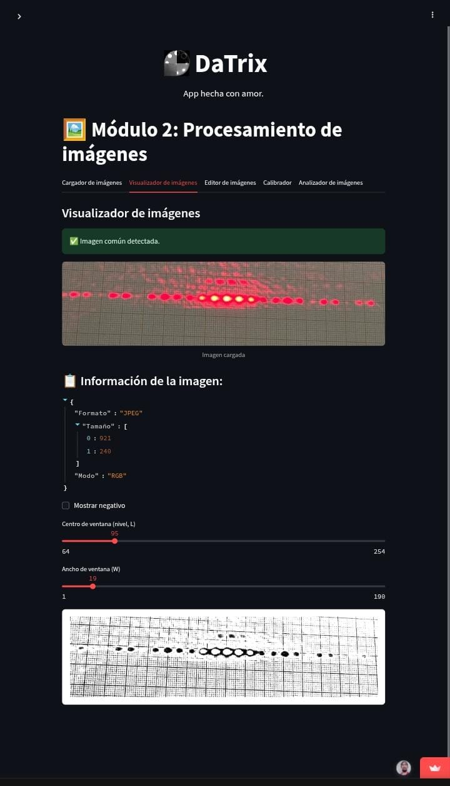
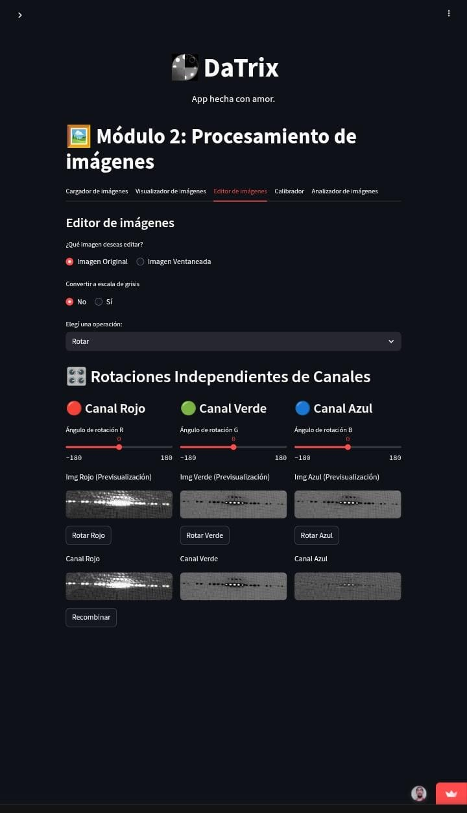
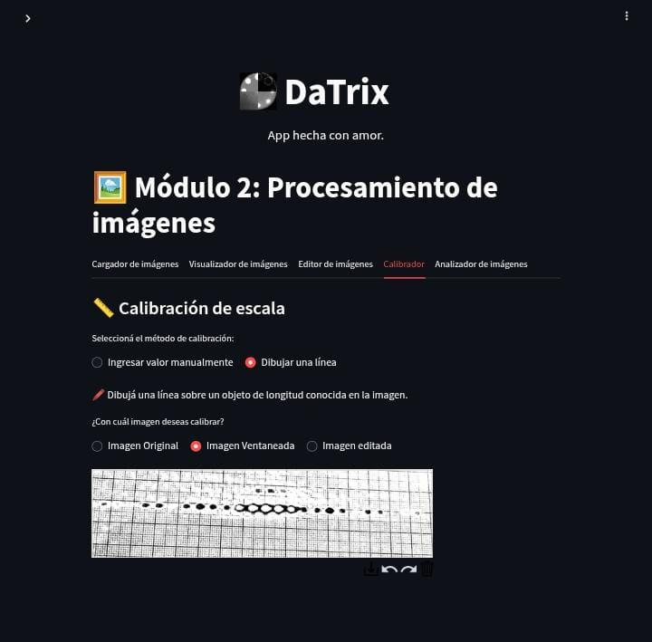
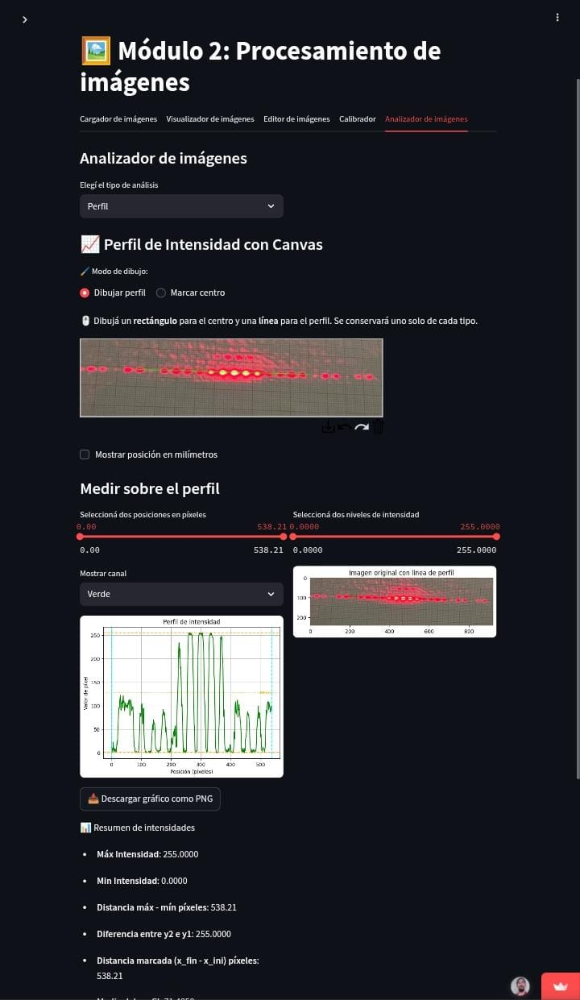
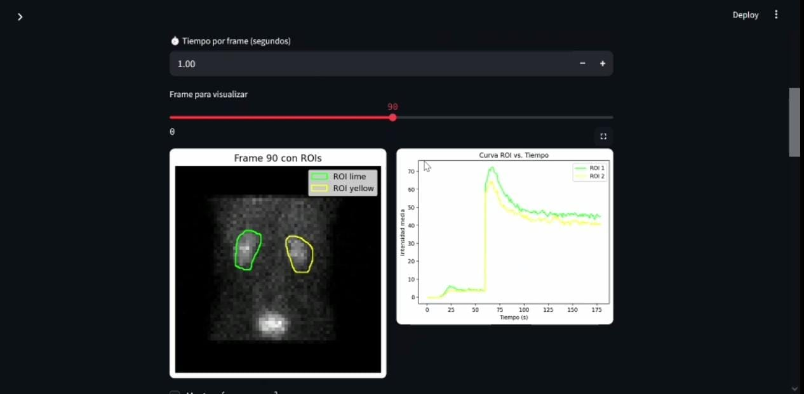
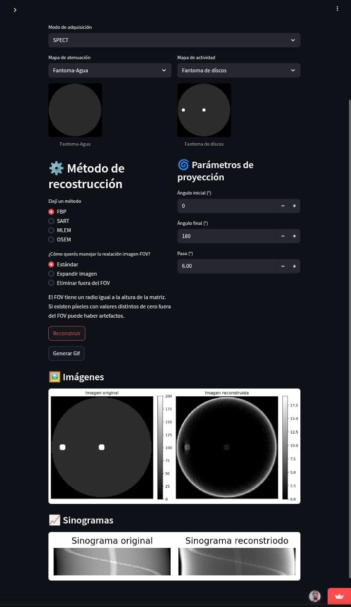

# DaTrix
**Datrix** es una app web desarrollada con **Python** y **Streamlit**, orientada estudiantes de **Ingeniería**, **Física Médica**, **Diagnóstico por Imágenes**.

Consta de 3 módulos principales:

---

## Álgebra y Análisis Númerico
Permite realizar:
- Operaciones con matrices
- Potencia, producto, suma por un escalar.
- Rango, transpuesta, determinante, inversa, autovalores y autovectores.
- Suma, resta, producto matricial. Producto, cociente bin a bin. Conmutador.
- Resolución de sistemas lineales, ajuste polnómico, ajuste exponencial, interpolación spline. Análisis de curvas, máximo y mínimo absoluto, integración, resolución de ecuaciones no lineales, análisis de Fourier.

## Procesamiento de Imágenes
Herramientas:

### Visualizador
- Imagen con ventaneo (como en imágenes de tomografía).
- Imágenes freme por frame.

### Editor
- Rotación.
- Brillo y contraste.
- Filtrado espacial: suavizado, realce de bordes, matriz personalizada.
- Filtrado frecuencial: pasa bajos, pasa altos, gaussiano, pasa altos gaussiano, rampa, Parzen, Shepp-Logan, Hann, Hamming, Butterworth.
- Operaciones morfológicas:  erosión, dilatación, apertura, cierre.
- Ecualización: global, adaptativa.

### Calibrador
- Permite ingresar manualmente el valor de milímetros por píxel.
- Permite trazar una línea sobre la imagen e ingresar a cuantos milímetros equivale la línea.

### Analizador
#### Histograma
- Permite visualizar histograma por canales, todos juntos, promedio o escala de grises.

#### Análsis de perfil de intensidad
- Permite anaizar por canales.
- Largo del perfil
- Distancias
- FWHM
- Máximo absoluto en una región rectangular.
- Mínimo absoluto en una región rectangular.
- Máxima intensidad.
- Mínima intensidad.
- Media del perfil.
- Integral (área bajo la curva).
- Resolución de ecuación f(x)=p.
- Análisis de Fourier.

#### Análisis de regiones de interés (ROI).
- Intensidad media en el ROI.
- Intensidad total en el ROI.
- Área del ROI.
- Diferencia de intensidad media entre ROIs.
- Diferencia de intensidad total entre ROIs.
- Operaciones entre imágenes, regiones: (fusión, intersección, sustracción).

#### Curvas ROI vs. tiempo para archivos multiframe (por ejemplo, en estudios dinámicos)
- Permite establecer tiempo por frame.
- Máximo y mínimo absoluto en una región rectangular de la curva.
- Integral (área bajo la curva).
- Resolución de ecuación f(x)=p.
- Análisis de Fourier.

## Reconstrucción Tomográfica
Simulador de reconstrución tomográfica de fantomas matemáticos.

### Métodos simulados
- Filtered Back Projection (**FBP**)
- Maximum Likelihood Expectation Maximization (**MLEM**)
- Ordered Subset Expectation Maximization (**OSEM**)
- Simultaneous Algebraic Reconstruction Technique (**SART**).

### Modos disponibles
- Computed Tomography (**CT**)
- Single Photon Emission Computed Tomography (**SPECT**).

### Parámetros configurables
- Ángulo inicial
- Ángulo final
- Paso angular
- Número de iteraciones
- Número de subsets
- Estimación inicial (FBP o imagen en blanco)
- Ruido
- Tratamiento del field of view (FOV)

### Gráficos
- N-RMSE vs. número de iteración (con métodos iterativos)
- Log-likelihood vs. número de iteración (con MLEM y OSEM)

### Figuras
- Imagen original sin ruido
- Imagen original con ruido
- Imagen reconstruida
- Imágenes con ventaneo (en modo TC)

### Animaciones
- Gif de la reconstrucción (proyección a proyección con FBP, iteración a iteración con métodos iterativos)

### Región de interés
- Comparación entre la misma ROI marcada en la imagen original y reconstruida.
- Diferencia de intensidad media.
- Diferencia de intensidad total.
- Error relativo.
- Gráfico del porcentaje de recuperación, diferencia de intensidad media y diferencia de intensidad total en función del número de iteración.

---
## Capturas de pantalla

### Álgebra

**Operaciones con matrices**

**Ajustes y análisis de curva**

### Procesamiento de Imágenes

**Visualizador**

**Editor**

**Calibrador**

**Análisis de Perfil**

**Curva ROI vs. tiempo**

### Reconstrucción Tomográfica

**Ejemplo: modo SPECT, método FBP**

---

## Futuras actualizaciones

### Inicio

- Descripción de cada módulo, tutoriales.

### Reconstrucción tomográfica

- Se añadirá  efecto de dispersión a la reconstrucción SPECT.
- Opción para incorporar correción de la atenuación y dispersión a los algoritmos MLEM y OSEM.
- Corrección de la atenuación post-reconstrucción a partir de un mapa de atenuación determinado por FBP.
- Corrección de la atenuación por el método de Chang.

---

## Enlace a la app

👉 [Ir a app]: https://datrix.streamlit.app/

---

## Tecnologías utilizadas

Este proyecto fue desarrollado en Python utilizando las siguientes bibliotecas:

- [**Streamlit**](https://streamlit.io/) `v1.45.1` – Framework principal para crear la app web
- [**NumPy**](https://numpy.org/) – Álgebra lineal y operaciones matriciales
- [**Matplotlib**](https://matplotlib.org/) – Gráficos 2D y visualizaciones
- [**SymPy**](https://www.sympy.org/en/index.html) – Cálculo simbólico
- [**SciPy**](https://scipy.org/) – Métodos numéricos (interpolación, ajuste, resolución de ecuaciones)
- [**scikit-image**](https://scikit-image.org/) – Procesamiento de imágenes
- [**OpenCV** (headless)](https://opencv.org/) – Edición y filtrado de imágenes
- [**Pillow**](https://python-pillow.org/) – Manejo de imágenes (carga, guardado, conversión)
- [**Pydicom**](https://pydicom.github.io/) – Lectura y análisis de archivos DICOM
- [**ImageIO**](https://imageio.github.io/) – Lectura de imágenes multiformato
- [**Pandas**](https://pandas.pydata.org/) – Análisis y manipulación de datos
- [**XlsxWriter**](https://xlsxwriter.readthedocs.io/) – Exportación de datos a archivos Excel `.xlsx`
- [**openpyxl**](https://openpyxl.readthedocs.io/) – Lectura y edición de archivos Excel
- [**streamlit-drawable-canvas**](https://github.com/andfanilo/streamlit-drawable-canvas) `v0.5.2` – Herramienta para dibujar ROIs y anotaciones
 
---

## Autor

**David Fernández Basti**

*Técnico Universitario en Diagnóstico por Imágenes*

*Estudiante de Ingeniería Nuclear.*
